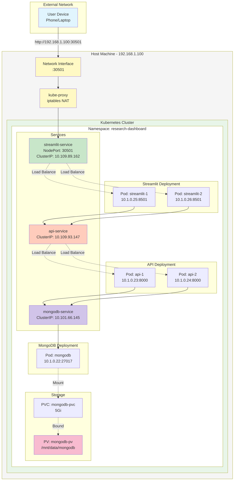

# How This Kubernetes Deployment Works

This document explains the architecture and networking mechanisms behind my Research Dashboard Kubernetes deployment, with emphasis on multi-host accessibility.

> **Quick Start**: See [README.md](../README.md) for deployment instructions.  
> **Visual Diagrams**: See [ARCHITECTURE.md](ARCHITECTURE.md) for additional system diagrams.

## Architecture Overview

The deployment runs on Docker Desktop with a single-node Kubernetes cluster:



## Deployment Components

### 1. Namespace Isolation

```bash
kubectl apply -f namespace.yaml
```

Creates the `research-dashboard` namespace for resource isolation and organization.

### 2. Storage Layer

**PersistentVolume (5Gi):**
- Backed by hostPath: `/mnt/data/mongodb`
- Reclaim policy: Retain (data persists after pod deletion)
- Access mode: ReadWriteOnce

**PersistentVolumeClaim:**
- Requests 5Gi storage
- Binds to the PersistentVolume
- Mounted by MongoDB pod at `/data/db`

### 3. Application Pods

**MongoDB (1 replica):**
- Database storage with persistent volume
- Internal ClusterIP service on port 27017
- Resource limits: 2 CPU cores, 2Gi RAM

**FastAPI (2 replicas):**
- Backend API with load balancing
- Connects to MongoDB via service DNS
- Resource limits: 1 CPU core, 1Gi RAM per pod

**Streamlit (2 replicas):**
- Frontend dashboard with high availability
- Connects to API via service DNS
- Resource limits: 1.5 CPU cores, 1.5Gi RAM per pod

### 4. Service Types

**ClusterIP Services (Internal):**
- `mongodb-service`: Database access within cluster
- `api-service`: API access with load balancing

**NodePort Service (External):**
- `streamlit-service`: Exposed on port 30501
- Accessible from any device on the network

## Multi-Host Networking

### How NodePort Works

NodePort exposes the service on a static port (30501) on all cluster nodes:

```
External Device (192.168.1.50)
    ↓
WiFi Network
    ↓
Host Machine (192.168.1.100:30501)
    ↓
kube-proxy iptables rules
    ↓
ClusterIP Service (10.109.89.162:8501)
    ↓
Load balancing to pods
    ↓
Streamlit Pod (10.1.0.25:8501 or 10.1.0.26:8501)
```

### Network Flow Example

When accessing `http://192.168.1.100:30501` from a phone:

1. **External Request**: Phone sends HTTP request to host's WiFi IP
2. **Network Interface**: Host receives packet on port 30501
3. **kube-proxy NAT**: iptables rules DNAT to ClusterIP service
4. **Load Balancing**: kube-proxy randomly selects one of two Streamlit pods
5. **Pod Processing**: Selected pod processes request
6. **API Call**: Streamlit calls `api-service:8000`
7. **API Load Balancing**: Request distributed to one of two API pods
8. **Database Query**: API pod queries `mongodb-service:27017`
9. **Response Chain**: Data flows back through the same path

### Load Balancing Mechanism

kube-proxy uses iptables rules for load distribution:

```bash
# Service receives traffic
-A KUBE-SERVICES -d <ClusterIP>/32 -p tcp --dport 8000 -j KUBE-SVC-API

# Random selection between endpoints (50/50)
-A KUBE-SVC-API -m statistic --mode random --probability 0.5 -j POD1
-A KUBE-SVC-API -j POD2

# DNAT to actual pod IPs
-A POD1 -p tcp -j DNAT --to-destination 10.1.0.23:8000
-A POD2 -p tcp -j DNAT --to-destination 10.1.0.24:8000
```

## Key Kubernetes Concepts

### Pods and Replication

**Pod**: Smallest deployable unit containing one or more containers

**ReplicaSet**: Ensures desired number of pod replicas are running
- Monitors pod health
- Recreates failed pods automatically
- Maintains exact replica count

**Deployment**: Manages ReplicaSets and enables rolling updates
- Declarative updates
- Rollback capability
- Version history

### Services and Discovery

**Service**: Stable network endpoint for accessing pods
- Persists despite pod IP changes
- Provides load balancing
- DNS-based service discovery

**DNS Resolution**:
```
mongodb-service → mongodb-service.research-dashboard.svc.cluster.local → 10.101.66.145
```

### Health Monitoring

**Liveness Probe**: Checks if container is running
- Restarts container on failure

**Readiness Probe**: Checks if pod can serve traffic
- Removes from service endpoints when failing
- Prevents routing to unhealthy pods

## Scaling to Production

### Multi-Node Deployment

In a production cluster with multiple nodes:

```
Node 1 (192.168.1.10)
├── Streamlit Pod 1
└── API Pod 1

Node 2 (192.168.1.11)
├── Streamlit Pod 2
└── MongoDB Pod

Node 3 (192.168.1.12)
└── API Pod 2
```

**NodePort on all nodes**:
- `http://192.168.1.10:30501` → Load balanced to any Streamlit pod
- `http://192.168.1.11:30501` → Load balanced to any Streamlit pod
- `http://192.168.1.12:30501` → Load balanced to any Streamlit pod

### Cross-Node Communication

Pods on different nodes communicate via overlay network:

```
Pod on Node 1 (10.1.0.25)
    ↓
CNI Plugin (e.g., Calico, Flannel)
    ↓
VXLAN/BGP encapsulation
    ↓
Physical network
    ↓
Node 2 receives and decapsulates
    ↓
Pod on Node 2 (10.1.1.15)
```

## Benefits of This Architecture

### High Availability
- Multiple pod replicas survive individual failures
- Automatic pod recreation by ReplicaSet
- Load distribution prevents single point of failure

### Load Balancing
- Traffic distributed across 2 Streamlit replicas
- Traffic distributed across 2 API replicas
- Automatic failover to healthy pods

### Scalability
```bash
# Scale to 5 replicas
kubectl scale deployment streamlit --replicas=5 -n research-dashboard

# Auto-scaling based on CPU
kubectl autoscale deployment api --cpu-percent=50 --min=2 --max=10
```

### Service Discovery
- Pods reference services by name
- No hardcoded IP addresses
- DNS automatically updated when pods change

### Persistent Data
- MongoDB data survives pod restarts
- PersistentVolume independent of pod lifecycle
- Data retained even after deployment deletion (Retain policy)

## Testing Kubernetes Features

### Load Balancing Test

```bash
# Send 10 requests
for i in {1..10}; do
  curl -s http://YOUR_IP:30501 > /dev/null && echo "Request $i: OK"
done

# Check which pods handled requests
kubectl logs -n research-dashboard -l app=streamlit --tail=20
```

### High Availability Test

**Terminal 1**: Simulate pod failure
```bash
kubectl delete pod -n research-dashboard -l app=streamlit --force | head -n 1
```

**Terminal 2**: Continuous access test
```bash
while true; do
  curl -s http://YOUR_IP:30501 > /dev/null && echo "Success" || echo "Failed"
  sleep 1
done
```

Expected result: Zero downtime - traffic automatically routes to remaining healthy pod.

### Horizontal Scaling Test

```bash
# Scale up
kubectl scale deployment streamlit --replicas=5 -n research-dashboard

# Verify distribution
kubectl get pods -n research-dashboard -l app=streamlit

# All 5 pods receive traffic
```

## Summary

This deployment demonstrates cloud-native architecture patterns:

| Component | Purpose | Configuration |
|-----------|---------|---------------|
| **Namespace** | Resource isolation | research-dashboard |
| **PersistentVolume** | Durable storage | 5Gi hostPath |
| **MongoDB** | Database | 1 replica, ClusterIP |
| **FastAPI** | Backend API | 2 replicas, ClusterIP |
| **Streamlit** | Frontend | 2 replicas, NodePort |
| **kube-proxy** | Load balancing | iptables NAT rules |
| **CoreDNS** | Service discovery | Internal DNS |

**Multi-host access** is enabled through NodePort service type, which exposes the application on port 30501 across all network interfaces. This allows any device on the same network to access the dashboard, demonstrating the scalability and accessibility patterns used in production Kubernetes deployments.

The same architecture scales from a single laptop (development) to hundreds of servers (production) without fundamental changes - only the node count and pod distribution differ.

---

**Navigation:**
- [← Back to Main README](../README.md)
- [Visual Diagrams →](ARCHITECTURE.md)
- [Documentation Index →](README.md)

**Version**: v1.1-multi-host  
**Last Updated**: December 2025  
**Related**: [README.md](../README.md) | [ARCHITECTURE.md](ARCHITECTURE.md)
