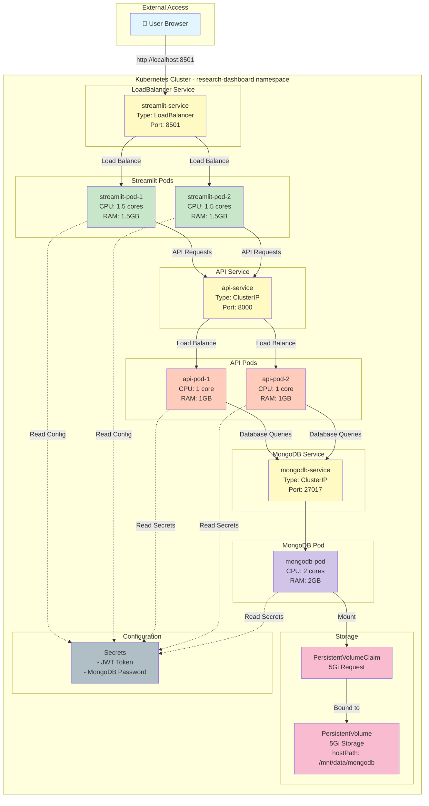
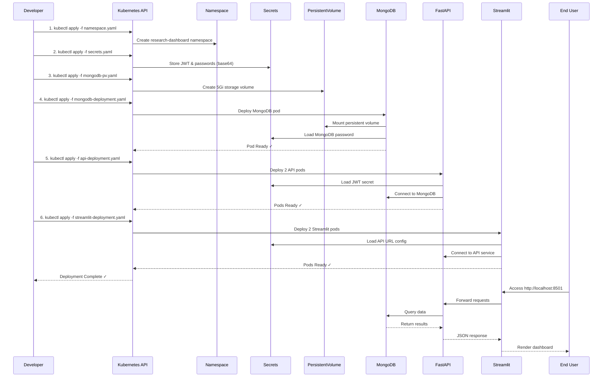
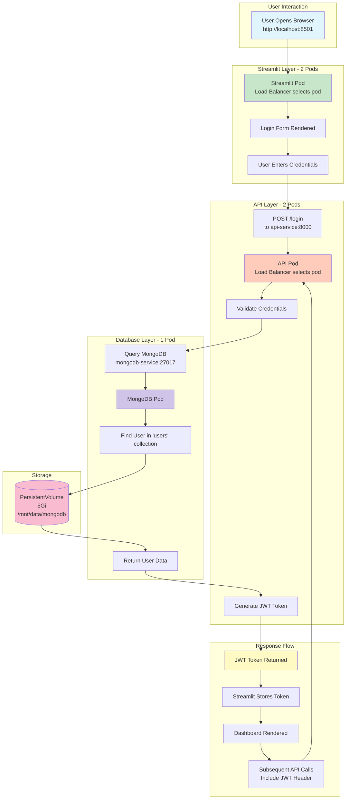
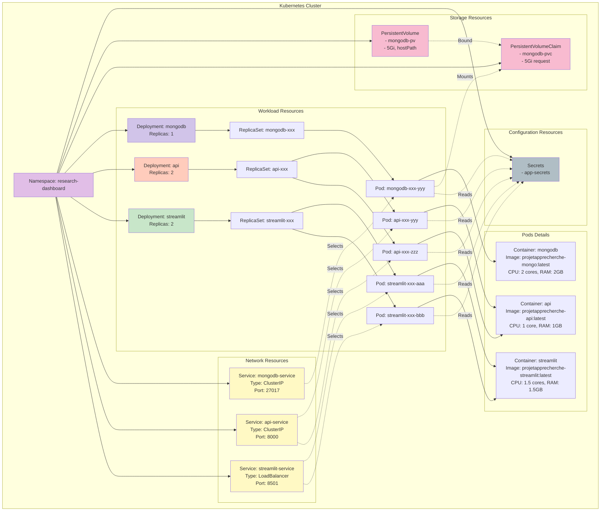
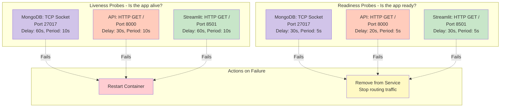
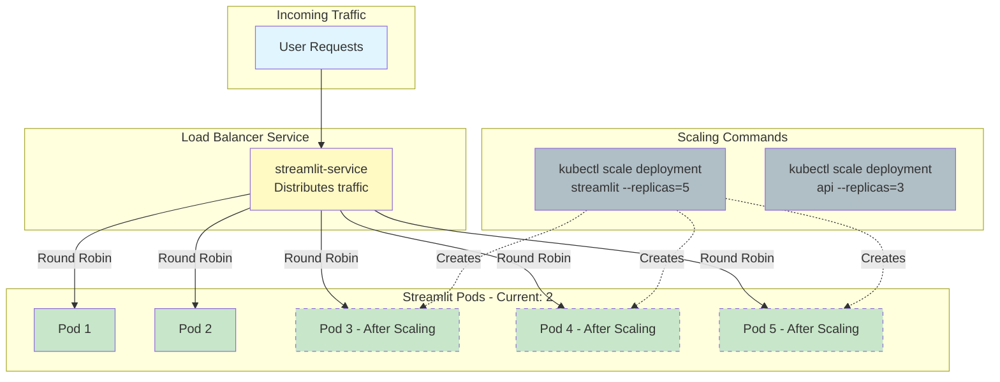
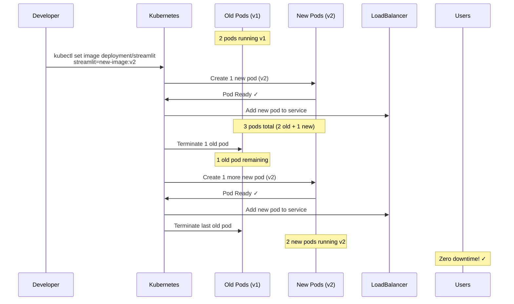

# Kubernetes Architecture - Research Dashboard

This document provides visual diagrams of the Kubernetes deployment architecture for the Research Dashboard application.

> **Deployment Guide**: See [README.md](../README.md) for setup instructions.  
> **Technical Details**: See [DEPLOYMENT_EXPLAINED.md](DEPLOYMENT_EXPLAINED.md) for architecture explanation.

---

## Table of Contents
- [Overview Diagram](#overview-diagram)
- [Network Architecture](#network-architecture)
- [Deployment Flow](#deployment-flow)
- [Data Flow](#data-flow)
- [Resource Hierarchy](#resource-hierarchy)

---

## Overview Diagram

This diagram shows the complete Kubernetes architecture with all components:



---

## Network Architecture

This diagram illustrates the network topology and service communication:

```mermaid
graph LR
    subgraph "External Network"
        Internet[🌐 Internet/Localhost]
    end
    
    subgraph "Kubernetes Network - research-dashboard"
        subgraph "External Layer"
            LB[LoadBalancer<br/>streamlit-service<br/>External: localhost:8501<br/>Internal: 10.106.x.x:8501]
        end
        
        subgraph "Application Layer"
            ST[Streamlit Pods x2<br/>ENV: API_BASE_URL=<br/>http://api-service:8000]
        end
        
        subgraph "API Layer"
            APISVC[ClusterIP<br/>api-service<br/>10.101.x.x:8000]
            API[API Pods x2<br/>FastAPI Server<br/>Port: 8000]
        end
        
        subgraph "Data Layer"
            DBSVC[ClusterIP<br/>mongodb-service<br/>10.108.x.x:27017]
            DB[MongoDB Pod<br/>Port: 27017]
        end
        
        subgraph "Storage Layer"
            PV[PersistentVolume<br/>5Gi]
        end
    end
    
    Internet -->|HTTP| LB
    LB -->|HTTP| ST
    ST -->|REST API| APISVC
    APISVC -->|Forward| API
    API -->|MongoDB Protocol| DBSVC
    DBSVC -->|Forward| DB
    DB -->|Read/Write| PV
    
    style Internet fill:#e3f2fd
    style LB fill:#fff9c4
    style ST fill:#c8e6c9
    style APISVC fill:#fff9c4
    style API fill:#ffccbc
    style DBSVC fill:#fff9c4
    style DB fill:#d1c4e9
    style PV fill:#f8bbd0
```



---

## Deployment Flow

This shows the sequence of deployment steps:



---

## Data Flow

This diagram shows how data flows through the system:



---

## Resource Hierarchy

This shows the Kubernetes resource organization:



---

## Component Details

### 📦 Pods and Replicas

| Component | Replicas | CPU Limit | Memory Limit | Purpose |
|-----------|----------|-----------|--------------|---------|
| MongoDB | 1 | 2 cores | 2GB | Primary database, stateful |
| FastAPI | 2 | 1 core | 1GB | Backend API, load balanced |
| Streamlit | 2 | 1.5 cores | 1.5GB | Frontend dashboard, load balanced |

### 🌐 Services

| Service Name | Type | Internal IP | External Access | Purpose |
|--------------|------|-------------|-----------------|---------|
| mongodb-service | ClusterIP | 10.108.x.x:27017 | Internal only | Database access |
| api-service | ClusterIP | 10.101.x.x:8000 | Internal only | API endpoints |
| streamlit-service | LoadBalancer | 10.106.x.x:8501 | localhost:8501 | User interface |

### 💾 Storage

| Resource | Type | Size | Path | Purpose |
|----------|------|------|------|---------|
| mongodb-pv | PersistentVolume | 5Gi | /mnt/data/mongodb | Physical storage |
| mongodb-pvc | PersistentVolumeClaim | 5Gi | - | Storage request |

### 🔐 Secrets

| Secret Name | Keys | Used By |
|-------------|------|---------|
| app-secrets | jwt-secret-key | API pods |
| app-secrets | mongo-password | MongoDB, API pods |

---

## Health Checks & Probes



---

## Scaling & Load Balancing



---

## Deployment Strategies

### Rolling Update Process



---

## Quick Reference Commands

### View Architecture
```bash
# See all resources in namespace
kubectl get all -n research-dashboard

# Visualize pod distribution
kubectl get pods -n research-dashboard -o wide

# Check services and endpoints
kubectl get svc,ep -n research-dashboard
```

### Monitor Traffic
```bash
# Watch pod logs in real-time
kubectl logs -f -n research-dashboard -l app=streamlit

# Check load balancer
kubectl describe svc streamlit-service -n research-dashboard
```

### Scale Components
```bash
# Scale up
kubectl scale deployment api --replicas=5 -n research-dashboard

# Scale down
kubectl scale deployment streamlit --replicas=1 -n research-dashboard
```

---

## Related Documentation

- **[Deployment Guide](../README.md)** - Setup instructions and operations
- **[Documentation Index](README.md)** - All documentation files
- **[Technical Deep-Dive](DEPLOYMENT_EXPLAINED.md)** - Architecture and networking details

---

**Navigation**: [↑ Main README](../README.md) | [Documentation Index](README.md) | [Deployment Explained](DEPLOYMENT_EXPLAINED.md)

---

*Generated for Research Dashboard - Kubernetes Deployment*
